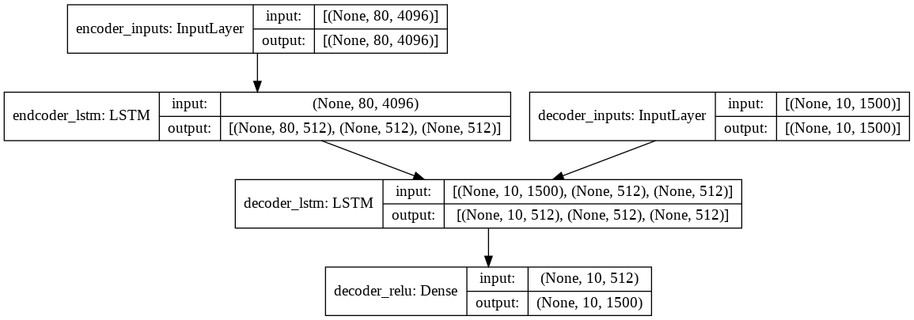
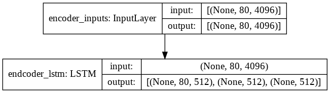
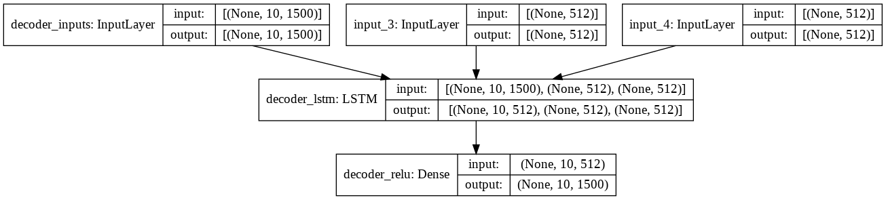
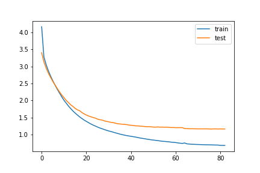
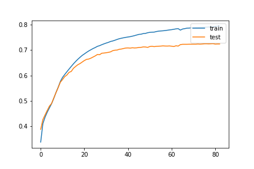
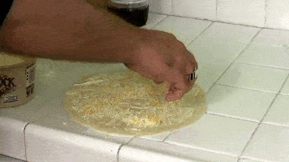

# Video-Captioning

Video Captioning is a sequential learning model that employs an encoder-decoder architecture. It accepts a video as input and produces a descriptive caption that summarizes the content of the video.

The significance of captioning stems from its capacity to enhance accessibility to videos in various ways. An automated video caption generator aids in improving the searchability of videos on websites. Additionally, it facilitates the grouping of videos based on their content by making the process more straightforward.

## Table of contents
* <a href="#Inspiration">Inspiration</a>
* <a href="#Dataset">Dataset</a>
* <a href="#Setup">Setup</a>
* <a href="#Usage">Usage</a>
* <a href="#Model">Model</a>
  * <a href="#TrainingArchitecture">Training Architecture</a>
  * <a href="#InferenceArchitecture">Inference Architecture</a>
  * <a href="#Loss">Loss</a>
  * <a href="#Metric">Metric</a>
* <a href="#Features">Features</a>
* <a href="#Scripts">Scripts</a>
* <a href="#FutureDevelopment">Future Development</a>
* <a href="#References">References</a>

<h2 id="Inspiration">Inspiration</h2>

While exploring new projects, I discovered video captioning and noticed the scarcity of reliable resources available. With this project, I aim to simplify the implementation of video captioning, making it more accessible for individuals interested in this field.

<h2 id="Dataset">Dataset</h2>

This project utilizes the <a href="https://opendatalab.com/MSVD">MSVD</a> dataset, which consists of 1450 training videos and 100 testing videos, to facilitate the development of video captioning models.

<h2 id="Setup">Setup</h2>

Clone the repository : <code>git clone https://github.com/MathurUtkarsh/Video-Captioning-Using-LSTM-and-Keras.git</code>

Video Caption Generator: <code>cd Video-Captioning</code>

Create environment: <code>conda create -n video_caption python=3.7</code>

Activate environment: <code>conda activate video_caption</code>

Install requirements: <code>pip install -r requirements.txt</code>

<h2 id="Usage">Usage</h2>

To utilize the pre-trained models, follow these steps:

1. Add a video to the "data/testing_data/video" folder.
2. Execute the "predict_realtime.py" file using the command: python predict_realtime.py.

For quicker results, extract the features of the video and save them in the "feat" folder within the "testing_data" directory.

To convert the video into features, run the "extract_features.py" file using the command: python extract_features.py.

For local training, run the "train.py" file. Alternatively, you can use the "Video_Captioning.ipynb" notebook.

<h2 id="Model">Model</h2>

<h3 id="TrainingArchitecture">Training Architecture</h3>

<h3 id="EncoderModel">Encoder Model</h3>

<h3 id="DecoderModel">Decoder Model</h3>

<h3 id="Loss">Loss</h3>
This is the graph of epochs vs loss. The loss used here is categorical crossentropy.

<h3 id="Metric">Metric</h3>
This is the graph of epochs vs metric. The metric used here is accuracy.

<h2 id="Features">Features</h2>
<ul>
 <li> Realtime implementation</li>
 <li> Two types of search algorithms depending upon the requirements</li>
 <li> Beam search and Greedy search</li>
 </ul>
 
The greedy search algorithm chooses the word with the highest probability at each step of generating the output sequence. In contrast, the beam search algorithm considers multiple alternative words at each timestep based on their conditional probabilities.

For a more detailed understanding of these search algorithms, you can refer to this informative <a href="https://machinelearningmastery.com/beam-search-decoder-natural-language-processing/">blog post</a>.

<h3 id="Performance">Performance of both algorithms on testing data</h3>
<table>
 <tr>
  <th>Video</th>
  <th>Beam Text(Time taken)</th>
 <th>Greedy Text(Time taken)</th>
 </tr>
<tr>
 <td></td>
 <td>a woman is seasoning some food(22.05s)</td>
<td>a woman is seasoning some food(0.70s)</td>
 </tr>
 <tr>
 <td></td>
 <td>a man is singing (13.79s)</td>
<td>a man is performing on a stage(0.77s)</td>
 </tr>
 <tr>
 <td></td>
 <td>the animal is sitting on the ground (21.16s)</td>
<td>a person is playing(0.67s)</td>
 </tr>
 <tr>
 <td></td>
 <td>a man is riding a bicycle (22.20s)</td>
<td>a man is riding a bicycle(0.66s)</td>
 </tr>
 <tr>
 <td></td>
 <td>a man is spreading a tortilla (25.65s)</td>
<td>a man is spreading a tortilla (0.75s)</td>
 </tr>
<tr>
 <td></td>
 <td>a woman is mixing some food (35.91s)</td>
<td>a woman is mixing some food(0.72s)</td>
 </tr>
 <tr>
 <td></td>
 <td>a dog is dancing (15.58s)</td>
<td>a dog is making a dance(0.68s)</td>
 </tr>
  <tr>
 <td></td>
 <td>a person is cutting a pineapple (24.31s) </td>
<td>a person is cutting a piece of pieces(0.70s)</td>
 </tr>
 <tr>
 <td></td>
 <td>a cat is playing the piano (26.48s) </td>
<td>a cat is playing the piano(0.70s)</td>
 </tr>
 <tr>
 <td></td>
 <td>a man is mixing ingredients in a bowl (38.16s) </td>
<td>a man is mixing ingredients in a bowl(0.69s)</td>
 </tr>
 </table>

 <h2 id="Scripts">Scripts</h2>
 
 * **train.py** contains the model architecture
 * **predict_test.py** is to check for predicted results and store them in a txt file along with the time taken for each prediction
 * **predict_realtime.py** checks the results in realtime
 * **model_final** folder contains the trained encoder model along with the tokenizerl and decoder model weights.
 * **features.py** extracts 80 frames evenly spread from the video and then those video frames are processed by a pre-trained VGG16 so each frame
    has 4096 dimensions. So for a video we create a numoy array of shape(80, 4096)
    config.py contains all the configurations i am using
 * **Video_Captioning.ipynb** is the notebook i used for training and building this project.

<h2 id="FutureDevelopment">Future Development</h2>
<ul>
 <li>Integrating attention blocks and pretrained embeddings (e.g., GloVe) to enhance the model's comprehension of sentences.</li> 
 <li>Exploring the use of other pretrained models, such as I3D, specifically designed for video understanding, to improve feature extraction.</li> 
 <li>Expanding the model's capability to handle longer videos, as it currently supports only 80 frames.</li>
 <li>Incorporating a user interface (UI) into the project for a more user-friendly experience.</li>
 <li>Using Chat-GPT API provided by Open-AI to get more creative and compelling captions.
</ul>

 <h2 id="References">References</h2>
 
 [SV2T paper 2015](https://arxiv.org/abs/1505.00487)
 
 [Keras implementation](https://github.com/CryoliteZ/Video2Text)
 
[Intelligent-Projects-Using-Python](https://github.com/PacktPublishing/Intelligent-Projects-Using-Python/blob/master/Chapter05) 

